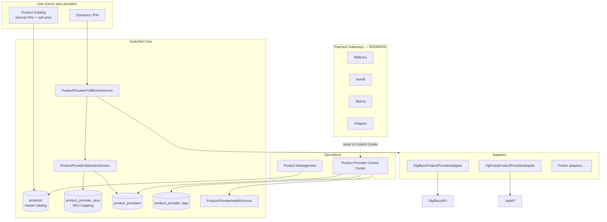
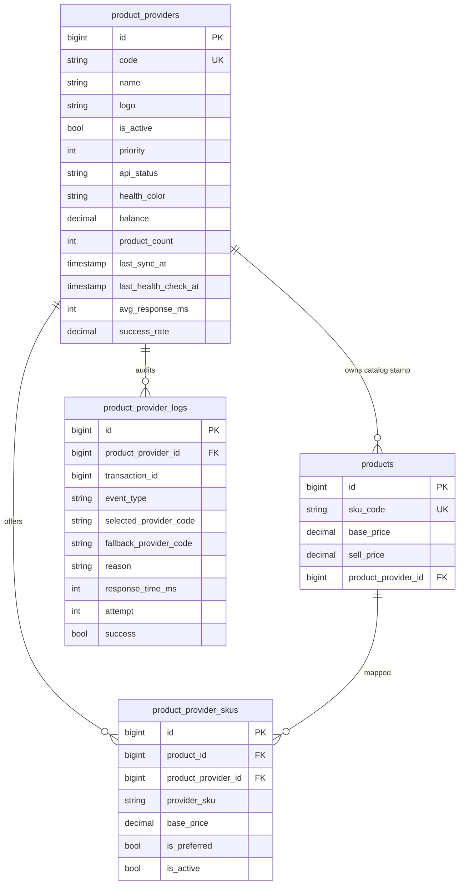

# Sprint 6 — Multi Product Provider Control Center

## 1. Architecture Diagram



## 2. Database Diagram



## 3. Provider Flow

```
User buys internal SKU FLASH1
  → CreateTransactionAction (pricing from products.sell_price)
  → ProcessProductProviderTransaction job
  → SelectionService: enabled providers with SKU mapping, order by preferred then priority ASC
  → Adapter.fulfill(provider_sku, customer_no, ref_id)
  → success | pending | fail+failover
```

## 4. Failover Flow

```
Try Digiflazz (priority 1)
  timeout / HTTP 5xx / maintenance / offline / insufficient balance / invalid response
    → log failover
    → Try VipPulsa (priority 2)
      → SUCCESS → user sees SUCCESS only
All exhausted → refund once + user-friendly failure (no provider name)
```

Disable Digiflazz in Control Center → selection omits it immediately (no deploy/restart).

## 5. Files Modified / Added

### Backend
- `database/migrations/2026_08_06_100000_sprint6_multi_product_provider_control.php`
- `app/Models/ProductProvider.php` (extended)
- `app/Models/ProductProviderSku.php` (new)
- `app/Models/ProductProviderLog.php` (new)
- `app/Models/Product.php` (`providerSkus`)
- `app/Services/ProductProviders/*` (adapters, registry, selection, health, fulfillment, control)
- `app/Jobs/ProcessProductProviderTransaction.php`
- `app/Http/Controllers/Api/v1/Admin/ProductProviderControlController.php`
- `app/Actions/Transaction/CreateTransactionAction.php` (dispatch multi-provider job)
- `app/Repositories/Eloquent/ProviderRepository.php` (upsert SKU offers on Digiflazz sync)
- `app/Actions/Admin/Operations/SyncDigiflazzCatalogAction.php` (block sync if Digiflazz disabled)
- `routes/api.php`
- `config/services.php` (VIP base_url / username)
- `tests/Feature/MultiProductProviderControlTest.php`

### Frontend
- `src/pages/dashboard/OperationsProductProviderControl.tsx`
- `src/services/operations.service.ts`
- `src/layouts/DashboardLayout.tsx`
- `src/router/index.tsx`

### Preserved
- `ProcessDigiflazzTransaction` job (still available / DigiflazzIntegrationTest)
- Digiflazz sync pipeline
- Master `products` pricing / checkout UX
- Payment gateways outside Control Center

## 6. Migration List

1. `2026_08_06_000001_create_product_providers_and_link_products.php` (prior)
2. `2026_08_06_100000_sprint6_multi_product_provider_control.php`
   - Extends `product_providers`
   - Creates `product_provider_skus` (+ backfill Digiflazz offers)
   - Creates `product_provider_logs`

## 7. API Added

| Method | Path | Purpose |
|--------|------|---------|
| GET | `/api/v1/admin/operations/product-provider-control` | Control Center cards |
| GET | `/api/v1/admin/operations/product-provider-control/{id}` | Single card |
| POST | `.../{id}/enable` | Enable |
| POST | `.../{id}/disable` | Disable (auto-switch) |
| POST | `.../{id}/set-primary` | Priority = 1 |
| PUT | `.../{id}/priority` | Set priority |
| POST | `.../{id}/health-check` | Health probe |
| POST | `.../{id}/sync` | Provider sync (Digiflazz wired) |
| GET | `.../{id}/logs` | Ops logs / failovers |

Existing Digiflazz `POST /admin/operations/sync` retained.

## 8. UI Added

- Operations → **Product Provider Control** (`/dashboard/operations/product-providers`)
- Cards: status, priority, API, balance, product count, last sync, latency, success rate, today/failed, health
- Actions: Sync Now, Health Check, Enable/Disable, Set Primary, View Logs

## 9. Validation

```bash
cd laravel
php artisan migrate
php artisan test --filter=ProductProviderArchitectureTest
php artisan test --filter=MultiProductProviderControlTest
php artisan test --filter=TransactionModuleTest
php artisan test --filter=DigiflazzIntegrationTest
```

Manual:
1. Open Control Center — Digiflazz + VipPulsa only (no Midtrans/Xendit).
2. Disable Digiflazz → purchase still works if VIP mapped+configured; else friendly failure.
3. Digiflazz Sync Now still upserts master products + SKU offers.
4. User checkout shows product/price/status only.

## 10. Deployment Steps

1. Deploy code (API + SPA).
2. `php artisan migrate --force`
3. Confirm `product_providers` priorities: Digiflazz=1, VIP=2.
4. Confirm Digiflazz `is_active=true` and credentials present.
5. Optional: set `VIP_BASE_URL`, `VIP_API_KEY`, `VIP_USERNAME` and enable VIP in Control Center.
6. Map VIP SKUs into `product_provider_skus` for products that should failover.
7. Run queue worker (`queue:work`) so `ProcessProductProviderTransaction` runs.
8. Smoke: ops sync Digiflazz, health check, one test purchase.
